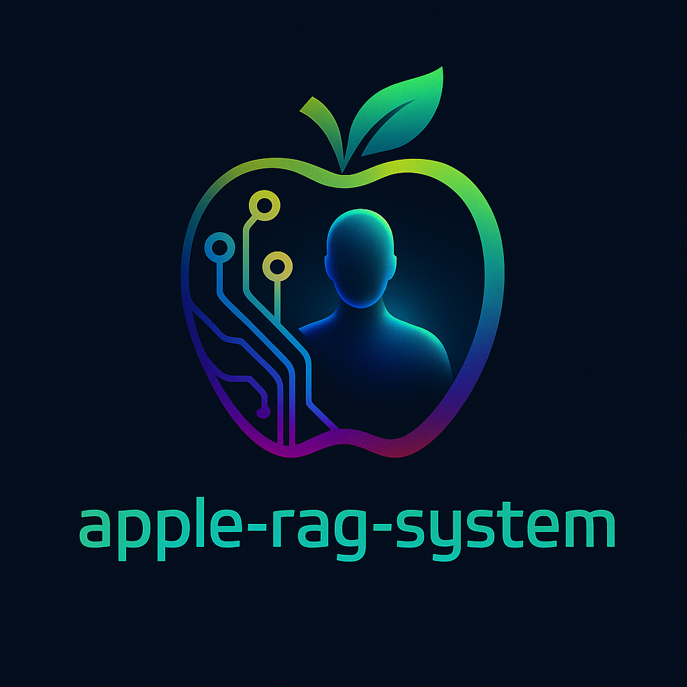

<p align="center">
  
</p>


apple-rag-system is a Python project that syncs notes from the macOS Notes app to a ChromaDB vector database, creates embeddings using the all-MiniLM-L6-v2 model, and enables querying the notes using Retrieval-Augmented Generation (RAG) with a language model.
Features

### Upcoming

The following features are coming soon:
- Auto sync optimization.
- Emails in the database.
- UI interface.

Syncs notes from the macOS Notes app to a ChromaDB vector database.
Generates embeddings for notes using the all-MiniLM-L6-v2 model by default.
Allows users to ask questions about their notes using RAG.
Simple command-line interface for syncing and querying.

## Prerequisites

- Python 3.12.9 or higher
- macOS (to access the Notes app)
- A valid API key compatible with the openai api.

## Setup
1. Clone the Repository: 
```
git clone https://github.com/BelG13/apple-rag-system.git
cd apple-rag-system
```

2. Create a Virtual Environment: 
```
python -m venv venv
source venv/bin/activate
```

3. Install Dependencies: 
```
pip install -r requirements.txt
```

4. Configure Environment Variables:

Create a .env file in the project root and add the following variables:
```
API_KEY=_api_key_here
BASE_URL='your base url here'
TOKENIZERS_PARALLELISM=true
HF_EMBEDDING_MODEL=sentence-transformers/all-MiniLM-L6-v2
DB_PATH='path to your chroma db, default is ./chroma'
```

Replace api_key_here with your actual LLM provider API key and BASE_URL too.

## Usage
### Sync Notes to ChromaDB
#### Manual Sync
To sync notes from the macOS Notes app to the ChromaDB vector database and generate embeddings:
```
python main.py --mode='sync' --flush
```
Remove the flush argument if you want to update your vector database.

This command:

- Extracts notes from the macOS Notes app.
- Creates embeddings using the all-MiniLM-L6-v2 model.
- Stores the embeddings in ChromaDB.

#### Auto sync
To sync notes automatically from the macOS Notes app to the ChromaDB vector database and generate embeddings:
```
python main.py --mode='sync' --auto'
```

This command periodically and Extracts notes from the macOS Notes app and update the chroma database if there
is new notes that are not stored.

### Query Notes
To ask a question about your notes using RAG:
```
python main.py --mode='query' --query="Your question here"
```

This command retrieves relevant notes from ChromaDB and uses the language model to generate an answer.

## Notes

Ensure the macOS Notes app is installed and contains the notes you want to sync.
The HF_EMBEDDING_MODEL can be changed to another Hugging Face embedding model, but all-MiniLM-L6-v2 is the default.
Set TOKENIZERS_PARALLELISM to true or false based on your performance needs.

## Contributing
Contributions are welcome! Please open an issue or submit a pull request with improvements or bug fixes.
License
This project is licensed under the MIT License. See the LICENSE file for details.
